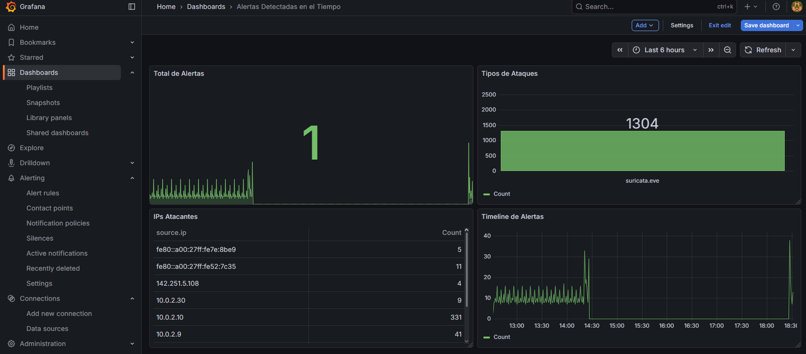
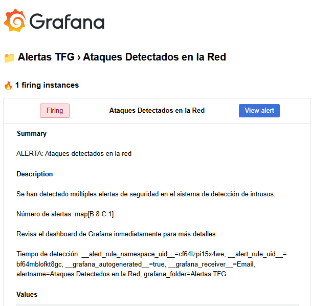
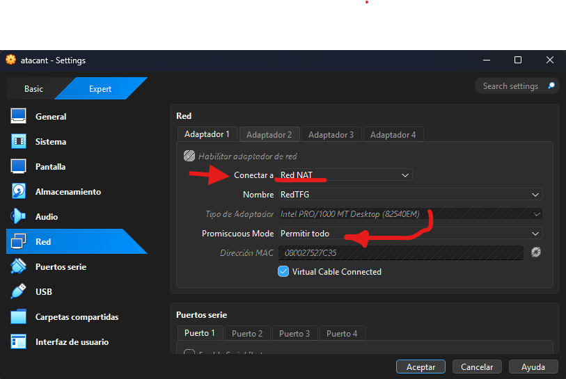
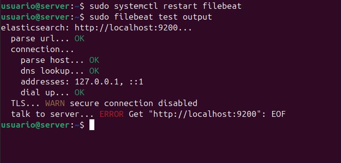

## Pruebas de Validación
Cuando tengamos todas las maquinas preparadas haremos el primer ataque:
### Hydra y Hping3

En ellos ademas de los ataques vemos como la maquina servidor detecta los ataques y muestra las alertas pero no es la fdorma mas visual y facil de ver por ello haremos: 

### Creación de alertas en Grafana 
Una vez creado el dashboard debemos comprobar que las alertas se registran de forma correcta:

### Enlace con Gmail
No solo basta con crear las alertas de forma correctas y con que nuestro dasboard estebien sino tenemos algo que nos avise, no? 
Por eso lo enlazaremos con nuestro correo personal para que nos lleguen las alertas: 

## Problemas Encontrados
Todo problema que hemos ido viendo por el camino se ha solucionado de forma correcta en el paso 3 de la UD3, pero aun asi debemos mecionar algunos que debemos tener en cuenta. 

- En muchas ocasiones el error más tonto y más sencillo es el que no vemos. Por ello siempre ten en cuenta que las maquinas deben estar conectadas y con la configuración correcta:

- Tambien podemos llegar a tener fallos más complejos como errores en la configuración de un archivo, al comprobarlo haciendo un test nos enseñara dicho error:
  

